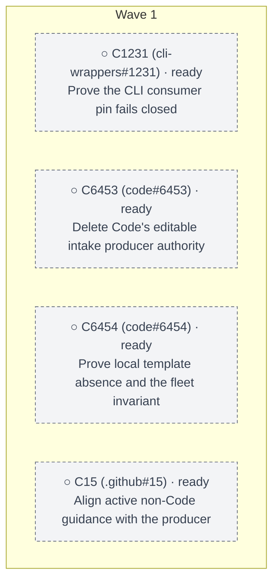

# .github#13 account-wide intake SSOT

Parent: https://github.com/spencer-shadley/.github/issues/13

## Outcome

spencer-shadley/.github is the only GovernedIntakeBodyV1 producer. Consumers name that producer commit and payload digest and fail closed. Normal repositories have no local issue template. Code's editable producer and copy/sync machinery is gone.

## Non-goals

- No new sync service, readonly clone roster, generic taxonomy validator, or GitHub Actions.
- No second consumer pin. The admitted pin is cli-wrappers `contracts/governed-intake-producer.pin.json` at `a30d28c382a32e41734d18f1b2b61698dacfdf32`.
- Do not bump that pin for tip `bec8f12f1f9b1e40eeb93913a89c5e14e3fea97e` (SECURITY.md only).
- code#6761 stays paused.
- code#6463, code#6465, code#6468, model-router#1124, model-gateway#1334, model-gateway#1335, model-gateway#1497, and fleet-registry#137 stay with their own roots.

## Acceptance split

- Merge proofs: C1231, C6453, C6454, and C15 each on `origin/<default>` or closed with command evidence.
- Native inheritance: public and private form evidence without a ceremonial test issue when a native read exists.
- No separate human judgment gate.

## Sanity fold

- sanity: not-needed — producer, pin, leases, and acceptance are already on the open issues; the SECURITY.md tip is not a bundle change; deletion is git-revertible and destination-first.

## Phase-4 arm plan

- Watch id: gh13-account-intake-ssot-watch
- Cadence: 30m
- Ready wave: C1231, C6453, C6454, C15 in parallel. Code chunks use disjoint leases. Land C6453 and C6454 serially if both touch master.

## Wave DAG

<!-- dag-view:begin source=./gh13-account-intake-ssot.dag.json — generated from that data file by skills/programme-decomp-execute/scripts/dag-view.ts (`pnpm decomp:dag -- --write <file.md>`); edit the data file, never this block -->
**Programme DAG** [gh13-account-intake-ssot](https://github.com/spencer-shadley/.github/issues/13) — Account-wide issue-intake SSOT and local-template deletion · source of truth: `./gh13-account-intake-ssot.dag.json`

**4 chunks:** 4 ○ ready

| Chunk | What and why | Wave | Depends on | Blocked by | Status | Done when |
|---|---|---|---|---|---|---|
| `C1231` ([cli-wrappers#1231](https://github.com/spencer-shadley/cli-wrappers/issues/1231)) | Prove the CLI consumer pin fails closed | W1 | — | — | ○ ready | origin/master verifies the admitted .github pin and payload digest fail closed, or a PR that does so is merged |
| `C6453` ([code#6453](https://github.com/spencer-shadley/code/issues/6453)) | Delete Code's editable intake producer authority | W1 | — | — | ○ ready | origin/master has no editable GovernedIntakeBody producer; consumers fail closed on the admitted .github commit and payload digest |
| `C6454` ([code#6454](https://github.com/spencer-shadley/code/issues/6454)) | Prove local template absence and the fleet invariant | W1 | — | — | ○ ready | Current FleetRegistry members have no unexplained local issue-template override on the default branch, and a fleet invariant for that fact is on origin/master |
| `C15` ([.github#15](https://github.com/spencer-shadley/.github/issues/15)) | Align active non-Code guidance with the producer | W1 | — | — | ○ ready | Active .github guidance matches the live producer, and every other active authority hit is historical, already owned, or repaired on its default branch |

<!-- dag-view:end -->
